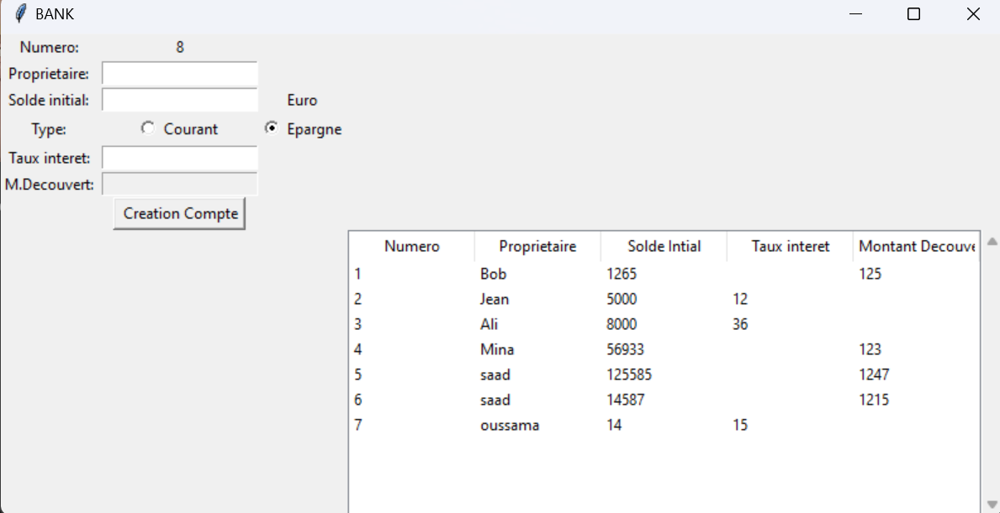

# BibCompte-2.0
This Tkinter-based GUI program manages bank accounts, enabling users to create savings or current accounts by inputting owner details, initial balance, interest rate (for savings), and overdraft amount (for current). Account data is stored in a "data.json" file.

# More details :
Explanation of Key Components:
  - **Tkinter Widgets:** The script uses various Tkinter widgets such as Labels, Entries, RadioButtons, and a Button to create a user interface for account creation and display.
  - **Account Creation Function (`Creation_COMPTE`):** This function is triggered when the user clicks the "Creation Compte" button. It reads user input, creates a new account (either savings or current), updates the account data in the "data.json" file, and displays the newly created account information.
  - **Treeview Widget:** A `ttk.Treeview` widget is used to display a table-like structure to show existing account details, including account number, owner name, initial balance, interest rate, and overdraft amount.
  - **Radio Buttons (`type_courant` and `type_epargne`):** These buttons allow the user to select the type of account (current or savings), and the `type_selected` function adjusts the input options accordingly.
  - **Scrollbar (`vsb`):** A vertical scrollbar is added to the Treeview widget to handle scrolling when there are numerous accounts displayed.
  - **Data Loading:** The script loads existing account data from the "data.json" file and populates the Treeview with this data during initialization.
